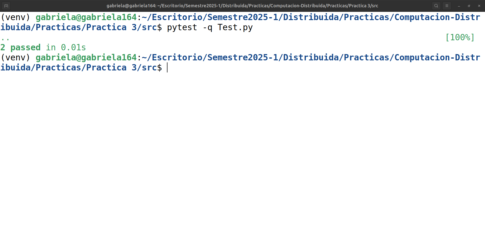

# 🌲 Práctica 3 de Laboratorio

* 📚 **CURSO**: Computación distribuida 2025-1  
* 👨🏼‍🏫 **PROFESOR**: Mauricio Riva Palacio Orozco  
* 👦🏻 **AYUDANTE LAB**: Yael Antonio Calzada Martín  
* 👦🏻 **AYUDANTE TEORÍA**: Alan Alexis Martínez López  
* ✍🏻 **OBJETIVO**: Implementación del algoritmo **BFS** y **DFS** en sistemas distribuidos.

 

    

 

<table>
    <tr>
        <th>Equipo</th>
        <th>No de cuenta</th>
    </tr>
    <tr>
        <td>López Diego Gabriela</td>
        <td>318243485</td>
    </tr>
    <tr>
        <td>San Martín Macías Juan Daniel</td>
        <td>318181637</td>
    </tr>
    <tr>
        <td>Martínez Hidalgo Paola Mildred</td>
        <td>319300217</td>
    </tr>
</table>

## 🔧 Evidencia pasan todas las pruebas

    

