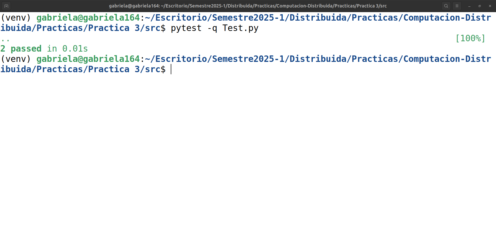

# 🌲 Práctica 3 de Laboratorio

* 📚 **CURSO**: Computación distribuida 2025-1  
* 👨🏼‍🏫 **PROFESOR**: Mauricio Riva Palacio Orozco  
* 👦🏻 **AYUDANTE LAB**: Yael Antonio Calzada Martín  
* 👦🏻 **AYUDANTE TEORÍA**: Alan Alexis Martínez López  
* ✍🏻 **OBJETIVO**: Implementación del algoritmo **BFS** y **DFS** en sistemas distribuidos.

 

    

 

<table>
    <tr>
        <th>Equipo</th>
        <th>No de cuenta</th>
    </tr>
    <tr>
        <td>López Diego Gabriela</td>
        <td>318243485</td>
    </tr>
    <tr>
        <td>San Martín Macías Juan Daniel</td>
        <td>318181637</td>
    </tr>
    <tr>
        <td>Martínez Hidalgo Paola Mildred</td>
        <td>319300217</td>
    </tr>
</table>

## 🔧 Evidencia pasan todas las pruebas

    

## Explicación de la implementación del algoritmo BFS 
La clase NodoBFS modela los nodos para poder aplicarles el algoritmo BFS, en el cual cada nodo cuenta con un identificador único (id_nodo) y un conjunto de nodos vecinos a los que le puede enviar un mensaje. Igual tenemos otras clases las cuales son los canales de comunicación para recibir y enviar mensajes.  
Explicaremos la implementación del algoritmo BFS. 
Primero empezamos con el nodo raíz, si el nodo raíz es id_nodo=0, entonces enviamos un mensaje "GO" a todos sus vecinos con su ID (self.id_nodo) y también se envía la distancia (self_distancia), usamos (yield env.timeout(TICK)) para el tiempo y el mensaje "GO" le indica a los vecinos que empiecen a explorar los demás nodos.   
Cuando caemos en while True cada nodo espera un mensaje en su canal de entrada. 
Si se recibe un mensaje "GO" tenemos tres casos.
 * Si el nodo aún no tiene un padre se establece como padre al nodo que le envió el mensaje, actualiza su distancia y envía mensajes "GO" a sus vecinos a excepto al padre. 
 * Si el nodo ya tiene un padre y recibe un mensaje de un nodo a una distancia menor, se actualiza su padre y envía un mensaje "GO" a sus vecinos. 
 * Si el nodo ya fue visitado y su nivel es menor o igual que el del nodo remitente, se manda un mnesaje "BACK" para indicar que ya fue visitado.  

Cuando un nodo recibe un mensaje "BACK" tiene que actualizar el contador de los mjs_esperados, en caso de que ya no haya mensajes por recibir de sus vecinos se envía un mensaje "BACK" a su padre.  
Los mensajes "BACK" se envían de abajo hacia arriba en el árbol de BFS, por lo que hasta que  el nodo raíz recibe el mensaje "BACK" se termina el algoritmo.

## Explicación de la implementación del algoritmo DFS
La implementación del algoritmo DFS en la clase NodoDFS simula cómo los nodos de una red exploran sus vecinos de manera recursiva, utilizando una estrategia de búsqueda en profundidad. Cada nodo está identificado por un id_nodo único y tiene un conjunto de vecinos con los que puede comunicarse mediante canales de entrada y salida. 

El proceso comienza en el nodo raíz, que es el nodo con id_nodo == 0. Este nodo se asigna a sí mismo como su propio padre y se marca como visitado. Luego, selecciona el vecino con el ID más pequeño entre sus vecinos y le envía un mensaje "GO", iniciando así el recorrido DFS. El objetivo del mensaje "GO" es preparar a los nodos receptores para que comiencen a explorar sus propios vecinos. A medida que los nodos reciben estos mensajes, asignan al nodo remitente como su padre y determinan si todos sus vecinos ya han sido visitados. Si todos los vecinos ya fueron explorados, el nodo envía un mensaje "BACK" al nodo padre, indicando que ha terminado de visitar a todos los nodos conectados. 

El algoritmo sigue explorando en profundidad seleccionando vecinos no visitados. Si un nodo encuentra que aún queda algún vecino sin visitar, selecciona el vecino no visitado con el ID más bajo y continúa la exploración enviando otro mensaje "GO". Si todos los vecinos de un nodo ya fueron visitados, el nodo envía el mensaje "BACK" hacia arriba, infromando a su padre que ha completado su parte de la exploración. 

A medida que el algoritmo progresa, los mensajes "GO" descienden en la red, dirigiendo a los nodos a explorar más profundamente, mientras que los mensajes "BACK" ascienden, informando del final de la exploración. La elección del vecino con el ID más bajo en cada paso da al algoritmo una estructura ordenada, y el conjunto de nodos visitados asegura que no haya repeticiones ni bucles. 
