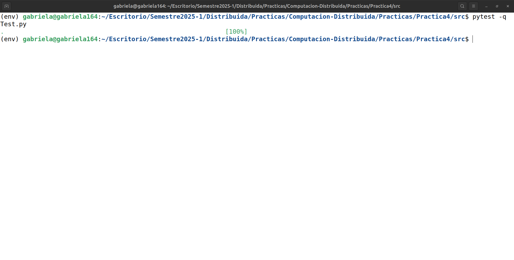

#  Práctica 4 de Laboratorio

* 📚 **CURSO**: Computación distribuida 2025-1  
* 👨🏼‍🏫 **PROFESOR**: Mauricio Riva Palacio Orozco  
* 👦🏻 **AYUDANTE LAB**: Yael Antonio Calzada Martín  
* 👦🏻 **AYUDANTE TEORÍA**: Alan Alexis Martínez López  
* ✍🏻 **OBJETIVO**: Implementación del algoritmo **consenso**

<table>
    <tr>
        <th>Equipo</th>
        <th>No de cuenta</th>
    </tr>
    <tr>
        <td>López Diego Gabriela</td>
        <td>318243485</td>
    </tr>
    <tr>
        <td>San Martín Macías Juan Daniel</td>
        <td>318181637</td>
    </tr>
    <tr>
        <td>Martínez Hidalgo Paola Mildred</td>
        <td>319300217</td>
    </tr>
</table>

## 🔧 Evidencia pasan todas las pruebas

## 💭 Explicación de la implementación del algoritmo

Para esta práctica se implementó el algoritmo de consenso, en el cual se prsentarán nodos los cuales fallarán durante la ejecución, a continuación explicaremos la forma en la que lo implemetamos.  

Primero se empieza definiendo el número de rondas que se tendrán, esto sera el total de fallos + 1. Después al pasar a while tendremos varios casos:

Primer if (línea 37-39): Si el id del nodo actual es menor al número máximo de fallos (f), entonces el nodo fallará. 

Segundo if (línea 41-43): Si se tienen nuevos mensajes (self.New), estos se envían mediante el canal de salida a los vecinos.

Tercer if (línea 45-49): Si nos encontramos en la última ronda el nodo actual espera el mensaje de algún vecino, el o los nodos vecinos que manden el mensaje mandarán su id y este será guaradado en rec_from por el nodo actual.

(línea 51) Como nos encontramos en la última ronda, una vez que se guardaron los mensajes vamos a vaciar la lista con el conjunto de mensajes que tenía, esto lo haremos ya que la lista debe de estar vacía para la siguiente ronda (recordemos que el total de rondas es de f+1). 

(línea 53-59) El nodo actual revisa los mensajes que recibió (if anterior) y si encuentra información nueva de algún vecino la almacena la lista de valores en self.V y agrega los nuevos mensajes a self.New para mandarlos en la siguiente ronda. 

(línea 61-65) Último if: En la última ronda el nodo actual revisa los valores de self.V, y aquí es donde se determina el líder, ya que si encuentra un valor que no sea None, este se proclama como el líder (self.lider) y lo devuelve como resultado (return elem).